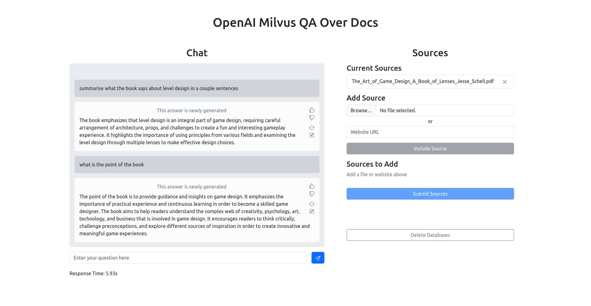
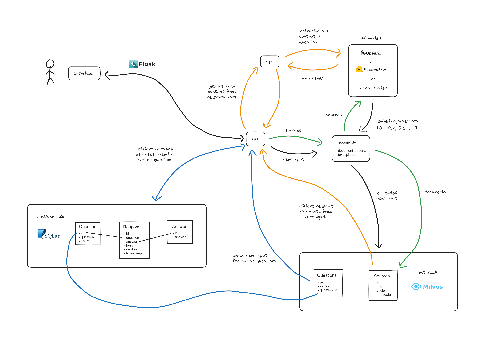

# OpenAI-Milvus-QA-Over-Docs

Uses [Milvus](https://milvus.io/) as a document store and [OpenAI's](https://platform.openai.com/docs/models/gpt-3-5) chat API for a simple app that allows the user ask question based on given sources. Stores every question asked and answer generated in an SQLite relational database which provides additional functionality and analysis.

- Supports CSV, PDF files
- Supports web pages
- Shows sources in response
- Aims to provide as much context to the AI model
- Stores all questions and answers
- No chat memory/history

## How it works

1. A Milvus and SQLite instance is run
3. Files and websites are ingested through [Langchain's](https://github.com/hwchase17/langchain) document loaders and text splitter
4. Documents embedded by OpenAI embeddings and added to Milvus collection through `langchain`. References of these documents are put in an SQLite table.
5. Only data ingestion done through Langchain, rest uses `pymilvus` and `openai`
6. A user inputs a query into the chat interface, and gets embedded by OpenAI embeddings (okay embeddings still done through `langchain`)
7. Similarity search is done with the embedded query on previous questions
8. Using distance, it deems whether the question is similar or identical to a previous question.
9. If so, retrieve the previous response
10. If there are no relevant questions or users specifies to generate a new answer, do a similarity search on the sources and retrieve the top 20 most similar documents
11. From the top 20, as much context/text is retrieved until the token limit is reached. 4096 for OpenAI gpt-3.5 (maximum set to 3700 to leave room for response tokens)
12. Instructions, the context, and the original question is given to the OpenAI chat model
13. Response is returned and displayed in a chat interface

## How to run

[Install and run a Milvus instance](https://milvus.io/docs/install_standalone-docker.md)

Make sure you have the necessary requirements to run the Python program

`pip install -r requirements.txt`

Create a `.env` file in the directory and put the OpenAI API key in as follows:

`OPENAI_API_KEY=...`

Then run the app with

`flask run` or `python3 app.py`

A Flask app will run locally. Click on the url provided in the terminal to open the app. For example:

`http://127.0.0.1:5000`